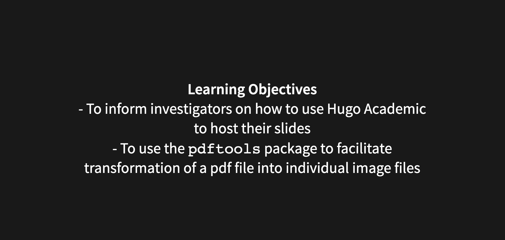

# Overview
- This working document is a user guide on how to enhance communication of **Clinical and Translational Research** by posting slides of your presentations and talks on your website using `blogdown` and `Hugo Academic`  
- `Hugo Academic` combined with `blogdown` allows for the ability to host slides of your talks so viewers can follow along with your during your presentation or have as a repository for later reference  
  - This also allows you to retain your slides and not be put in the uncomfortable position of "giving away" your precious slides that you spent countless hours on  
  - In particular we will focus on a pearl on how to fairly straightforwardly transform your powerpoint or pdf talk into images so they can be hosted on your `Hugo Academic` Website using a nice package called `pdftools`

# Initial Steps
- We are going to assume that you've already built your website using `blogdown` and `Hugo Academic`  
 - If you have not, please see our post [Communicating CT Research via Website Development with R](https://www.themillerlab.io/post/website-development-using-r/)

## First create a folder for your slides for the particular talk you want to post
- Within your main webstie working directory
  - Click through `content` -> `slides`
  - In the `slides` folder create a new folder that is specific for the slides your intended folder
  - In that folder you will then create an `index.md` markdown file which will control the content of your slides  
  - I would also recommend creating another folder in that folder where you can store images of slides from your powerpoint presentation or pdf presentation
    - I make one and call it `slides` but you can call it whatever you want

## Creating content in the `index.md` markdown
- The YAML in that index can look like this:  

authors:  
- admin  
categories: []  
date: "2019-12-09T00:00:00Z"  
slides:  
  highlight_style: dracula
  theme: black  
summary: Slides for ODAC Melanoma Talk 1-18-2020.    
tags:  
- Melanoma  
- Dermatology  
- Medical Oncology  
title: Therapeutic Updates in Melanoma - IO for Earlier Stage Disease

---

## Underneath the YAML, you will build the content of your slides

---

- Each set of slides will be seprated by two three dash segments such as:  


---

### You can create any content you want in these slides such as:


---

That will create slides that look like this:





## Using your actual slides from powerpoint or pdf as slides on your website  
- Instead of creating your slides for your website manually using `Hugo Academic` or `blogdown` you can make images of your `powerpoint` files and use them as a backdrop (which is my preference)  
- This can produce really nice looking slides, but it can be a bit labor intensive  
- One approach is to `print` your slides in `powerpoint` to `pdf` format and then convert each slide to a single pdf or jpg file and put those files in you `slides` folder that you created  
 - But doing this slide by slide is quite tedious  
   - Enter a slick `Data Science Solution`
     - Make use of a wonderful package called `pdftools`  
       - this allows you to convert one to all of your pdf slides to a variety of image types
- `pdftools`will greatly reduce your work load
 
## Let's use an example from one of our presentations
- In January, we had a `powerpoint` presentation on IO therapy in earlier stage melanoma  
- After creating the `powerpoint` presentation we printed the `ppt` to `pdf`  
  - That pdf was titled `melanoma_odac.pdf`
    - To faciliate the creation of the slide presentation using `blogdown` we made use of the `pdftools` package as follows:

**Load the `pdftools` package**
```{r, eval=FALSE}
library(pdftools)
```


**Convert PDF to JPEG**  
- Use the following code for this:  
`pdf_convert("melanoma_odac.pdf", format = "jpeg", pages = NULL, filenames = NULL, dpi = 300, opw = "", upw = "", verbose = TRUE)`  

- Of note, `melanoma_odac.pdf` is the name of the pdf that you want to convert slide by slide to jpeg, this file should be in the same working directory as the Rproject that you are working with  
  - Once you execute this function, each slide will be converted into the image format of your choosing -> in this case we chose jpeg  
    - This is important, b/c it should match the code in your `index.md` markdown for your slides presentation  
    - Each slide will be automatically labeled as `melanoma_odac_1.jpeg` followed by `melanoma_odac_2.jpeg`, etc. 

#### Important nuances of the code  
- pages = NULL will convert all of the slides to individual slide  
- dpi = 300 is the resolution of the images that you are saving

## Format your `index.md` appropriately  
- Then, if you want your jpeg slides to take up the whole entire slide, make them a backdrop  
- Here is an example of what Dr. Miller's `index.md` file looked like


- To see how this turns out [click here](https://www.themillerlab.io/slides/odac_melanoma-1-18-20/#/)

### That's it for now, please let us know if this was helpful or if you have any additional feedback