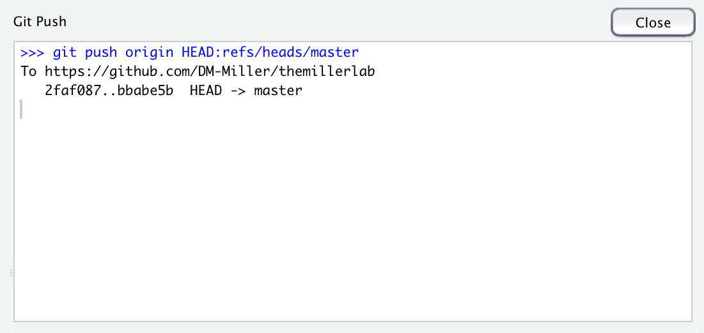
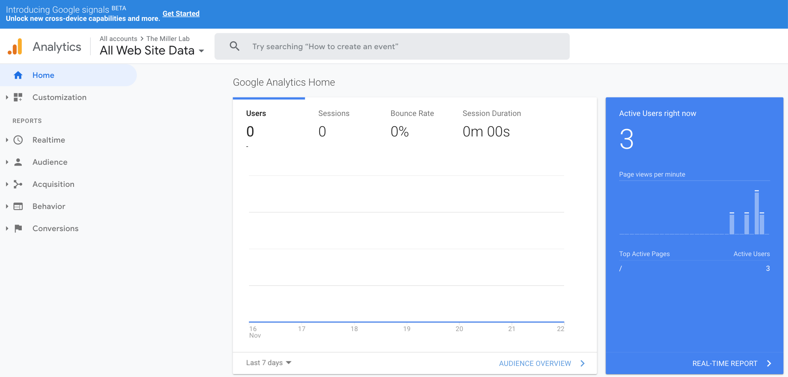

# Overview
* Almost everyone in Academia these days has a website. Indeed, websites are a fabulous way to post content and more effectively communicate your Clinical and Translational Research.  
* There are many tools and services that can assist you in developing a very functional website.  
* This working document is a rough user guide on how to create a website using R via a package called `blogdown`. It will also walk you through opening in account on Netlify, which will host your website.
* There are numerous resources for webpage development, including an amazing bookdown called "blogdown: Creating Websites with R Markdown" (https://bookdown.org/yihui/blogdown/). We've created this resource as we have tried to provide details and pearls that we struggled with and we belive these may be helpful to others.
* This is a ongoing, 'living' document that is constantly being edited and expanded. Please provide comments to allow us to optimize this document for all R users.

# Getting Started 
## Load Packages for RMarkdown
```{r run tinytex, warning=FALSE, message=FALSE}
tinytex::install_tinytex()
```

```{r setup, include=FALSE}
knitr::opts_chunk$set(echo = TRUE)
```

## Github
1. Register a GitHub account  (https://github.com)
2. Create a new Repository (“+” sign in the upper right hand corner)  
3. Create a name for the repo and remember this as it will be used   
3. Copy the github repo address  

## R
### Starting Your Project
1. Create a new project in R using version control  
- File -> New Project -> Version Control -> Git (clone a project from a Git repository)  
- Enter the Git Repository URL:e.g. https://www.github.com/DM-Miller/themillerlab  
- Create Project (open in new session would be my recommendation  
2. Install blogdown 
```{r install blogdown, warning=FALSE, message=FALSE, eval=FALSE}
if (!requireNamespace("devtools")) install.packages("devtools")
devtools::install_github("rstudio/blogdown")
```

3. Load blogdown
```{r load blogdown, warning=FALSE, message=FALSE, eval=FALSE}
library(blogdown)
```
4. Create a new_site
```{r new_site, warning=FALSE, message=FALSE, eval=FALSE}
new_site()
```
- this will install Hugo and download new files  
- The default theme is lithium
- If you want a different one (e.g. hugo-academic) add the following into the function: 
```{r hugo-academic, warning=FALSE, message=FALSE, eval=FALSE}
new_site(theme = "gcushen/hugo-academic")
```
* Once you do this it will download all of the necessary files into your working directory    
  * for example:  
  


# Build Your Site
## build_site()
Use the function `build_site()` in the `blogdown` package
```{r build_site, eval=FALSE}
blogdown::build_site()
```
## serve_site()
```{r serv_site, eval=FALSE}
blogdown::serve_site()
```
This function allows you to serve your website locally so you can view it in the "Viewer" tab in the "Files Plots Packages Help Viewer" pane
## Commit Changes to GitHub
1. Once you've set up your version control to github, each change that you make will be tracked by R. These changes will be cataloged in the Git Pane.  

  
  
2. To commit them to GitHub, select all of the files and click on one of the check boxes.  
  
  

3. Then click on the "Commit" button in teh above pane    
4. That will bring up a new window which will allow you to review the changes you've made. Write a message in the "Commit Message" Box in order to annotate the changes.  
  

  * Of note, these changes will show up in GitHub under "Commit".  
    

    
5.  Then press "Commit". After you do that a new window will pop up called "Git Commit".  
  

  
6. Then press "Close". Press "Push" in the Review Changes Pane, which will push the changes to GitHub. This window will pop up. Once it has been pushed, press "Close". That should be it.  
  


# Netlify
## Overview
* Netlify is a is a San Francisco-based cloud computing company that offers hosting and serverless backend services for static websites (source: https://en.wikipedia.org/wiki/Netlify).  
* There are other options. We've used it to host our website.  
* Here are a few steps to get started:
1. Go to netlify (https://www.netlify.com) and sign up  
2. We would recommend signing up with your GitHub account, especially if your are doing to deploy your website from this account  
3. Launch a New Site from Git  
4. Select Continuous Deployment from GitHub  
5. Pick your GitHub Repository for which you want Continuous Deployment  
6. Modify Settings (here's an example)  
  

7. Select Deploy Site
8. Select a Domain Name (you can purchase one from Netlify if it is available)

# Designing a Website Using Hugo-Academic
## Overview
* Hugo-Academic is a very reasonable theme for a academic website  
  * for an example see: https://www.themillerlab.io

## Configurating the Website
### Overview
* There are several config files that you need to know about  

#### config.toml  
* This file is where you will create the Title of your website  
# Title of your site  
title = "The Miller Lab"    

#### menus.toml
* Location  
  * config/_default/menus.toml  
* This is where you will control which items go on the top menu ribbon on your website.  
  

* This is the default  

[[main]]  
  name = "Demo"  
  url = "#hero"  
  weight = 10  

[[main]]  
  name = "Posts"  
  url = "#posts"  
  weight = 20  

[[main]]  
  name = "Projects"  
  url = "#projects"  
  weight = 30  

[[main]]  
  name = "Publications"  
  url = "#featured"  
  weight = 40  

[[main]]  
  name = "Courses"  
  url = "courses/"  
  weight = 50  

[[main]]  
  name = "Contact"  
  url = "#contact"  
  weight = 60    

#### params.toml
* Location  
  * config/_default/params.toml  
* This is where you will control which items such as  
  * Logo
  * Contact Details (email, addresses, etc)
  * Social Media Details
  * Configuration of publication pages
  * Marketing such as Google Analytics  
    
  

## Widgets in Hugo Academic
### Overview 
* The academic theme has lots of widgets; these are in your home folder; look fofr “active = “ and assign true or false depending on whether or not you want them “active = false” will hide the widget  
* The Hugo project uses +++ to denote demarcation for TOML documents. It is a way for them to have a single text file that consists of TOML in the "frontmatter" (document meta-data), and a second "document" that is the body of page content.  

<span style="text-shadow: none;"><a class="github-button"   href="https://github.com/gcushen/hugo-academic"   data-icon="octicon-star" data-size="large"   data-show-count="true" aria-label="Star this on GitHub">Star</a><script async defer   src="https://buttons.github.io/buttons.js"></script></span>  

Octicon-start and Get Started Clicker  

### Hero widget
* This is the first widget worth adjusting  
* This is where you change the title of the  
* Within the TOML, you can add text using  
[cta_note]  
  label = '<a class="js-github-release"   href="https://sourcethemes.com/academic/updates"   data-repo="gcushen/hugo-academic">Latest release<!-- V --></a>'  

[cta]  
  url = "https://sourcethemes.com/academic/docs/install/"  
  label = "Get Started"  
  icon_pack = "fas"  
  icon = "download"  
  
[cta_alt]  
  url = "https://sourcethemes.com/academic/"  
  label = "View Documentation"  

### People Widget  
* Under content -> Home -> people.md  
* This will allow you place a “Meet the Team” segment on the web page  
* User_groups = [ ]  is key  
* Within the [ ] you should specify the names of the subfolders in the “authors”  
* For example  
  + Choose which groups/teams of users to display. 
  + Edit `user_groups` in each user's profile to add them to one or more of these groups.  
  + user_groups = ["Fellows", "Students"]  
  + Fellows and Students are the strings that you use in the _index.md files within each persons folder. "Authors" wd -> content -> authors
  + What I did was create a subfolder of each person in "Authors" wd -> content -> authors
  + For example `wd -> content -> authors -> John-Doe`  
    - Then with the subfolder "John-Doe" the info for the site is placed in a .md or .Rmd file called `_index.md` or `_index.Rmd`. 
    - Then you list the person's user-group accordingly and they will show up under that heading.   
    - Within the ``_index.md` file, use the following 
  +  authors:  
  - John-Doe    
* Then when you want to "tag" that person in say a post or a talk, you can write "- John-Doe" in under the `authors:` section of the YAML in that specific posting or talk

### Talk Widget
* To edit content go to content -> talk   
  * Then edit
* Example code that was embedded in default Talk widget page
{}  
Click on the **Slides** button above to view the built-in slides feature.  
{}  

* Slides can be added in a few ways:  
  * **Create** slides using Academic's  
  [*Slides*](https://sourcethemes.com/academic/docs/managing-content/#create-slides) feature and link using `slides` parameter in the front matter of the talk file  
  * **Upload** an existing slide deck to `static/` and link using `url_slides` parameter in the front matter of the talk file

* Example from the miller lab website
  * I created a folder in “static” called “slides”
  * Then I put the pdf of “MIG_3-1-19.pdf” in that folder  
  * Then in the index.md file under content->talk->MIG_3-1-19 I used the following  
  url_slides: "slides/MIG_3-1-19.pdf"  
  * I also removed “example” from line 29
  * Slides: “ ”  
  * This was key, otherwise it didn’t work

* **Embed** your slides (e.g. Google Slides) or presentation video on this page using   [shortcodes](https://sourcethemes.com/academic/docs/writing-markdown-latex/).  

* Further talk details can easily be added to this page using `*Markdown* and $\rm \LaTeX$ math code.`
  
* In the new folder you created you will need a index.md file and potentially a features.jpg  
* Then make edits the index.md prn

### Projects Widget
* Md document is in the Home folder “projects.md”  
  * content -> home -> projects.md  
* There is a built in mechanism to link your active projects
* The details for your project, however is located:
  * Content -> project
  * Within thei “project” folder you can add new subfolders of the different ongoing projects
* Toolbar  
  * There is a tool bar feature that you can edit, e.g.  
  [[content.filter_button]]  
    name = "Data Science"  
    tag = "data-science"  
* projects subfolder  
  * As mentioned above, the actual descriptions of the projects are in 
  * Content -> project
  * Here’s an example
  * Content -> project -> data-science
* With the “data-science” subfolder, there are two key files
  * Featured.jpg (the picture that will be feature)  
  Index.md
* Index.md for projects
  * Here put the data you want in the YAML
* Pay attention to  
  * Tags:
  * -data-science
  * This will link this file to the tool bar in the projects page

### Talks Widget
#### Overview
* "Presentations" in the menu ribbon are edited with the talks widget  
* The content of those presentations is stored in the "talk" folder  
  * Location of that folder: content/talk
* Then create new folders in that "talk" folder, each of which represents a new presentation that you've given  

#### Below is the canned Text that comes as a default  
abstract: Lorem ipsum dolor sit amet  

address:  
  city: Stanford
  country: United States
  postcode: "94305"
  region: CA
  street: 450 Serra Mall  
all_day: false  
authors: []  
date: "2018-06-01T13:00:00Z"  
date_end: "2018-06-01T15:00:00Z"  
event: Academic Theme Conference  
event_url: https://example.org  
featured: false  
image:  
  caption: 'Image credit: [**Unsplash**](https://unsplash.com/photos/bzdhc5b3Bxs)'
  focal_point: Right  
links:
- icon: twitter
  icon_pack: fab
  name: Follow
  url: https://twitter.com/georgecushen
location: Source Themes HQ
math: true
projects:
- internal-project  
publishDate: "2017-01-01T00:00:00Z"  
slides: example  
summary: An example talk using Academic's Markdown slides feature.  
tags: []  
title: Example Talk  
url_code: ""  
url_pdf: ""  
url_slides: ""  
url_video: ""  

{}
Click on the **Slides** button above to view the built-in slides feature.
{}

Slides can be added in a few ways:

- **Create** slides using Academic's [*Slides*](https://sourcethemes.com/academic/docs/managing-content/#create-slides) feature and link using `slides` parameter in the front matter of the talk file
- **Upload** an existing slide deck to `static/` and link using `url_slides` parameter in the front matter of the talk file
- **Embed** your slides (e.g. Google Slides) or presentation video on this page using [shortcodes](https://sourcethemes.com/academic/docs/writing-markdown-latex/).

Further talk details can easily be added to this page using `*Markdown* and $\rm \LaTeX$ math code.`


## Other Pearls  

### Links in Hugo
* The default Hugo target directory for your built website is public/  
  * Therefore, if you want to link to a file with this format
  * `[Merkel Cell Carcinoma tumor Registry](MCC_Registry.Rmd)`  
  * Then the MCC_Registry.Rmd file must be in the public folder; this tripped me up for hours!
  * This is considere a permalink

### Netlify TOML
* I Ran into a problem where I could not deploy from GitHub to Netlify  
* I ran the error message into google and Alison Hill recommended that I create a netlify.toml  
* https://alison.rbind.io/post/2019-02-19-hugo-netlify-toml/  
* The key was addint the hugo_version to the latest version I was workin on (see below)  
* Created netlify.toml in R in the workin directly (see content below)  
* I then pushed it to GitHub and was all set!
- This is the code I got from Alison Hill's website  

  [build]  
	  publish = "public"  
	  command = "hugo"  
	
	[context.production.environment]  
	  HUGO_VERSION = "0.59.1"  
	  HUGO_ENV = "production"  
	  HUGO_ENABLEGITINFO = "true"  
	  
	[context.branch-deploy.environment]  
	  HUGO_VERSION = "0.59.1"  
	

	[context.deploy-preview.environment]  
	  HUGO_VERSION = "0.59.1"  
	  
	[context.deploy-preview]  
	  command = "hugo -b $DEPLOY_PRIME_URL --buildFuture"  
	

	[context.branch-deploy]  
	  command = "hugo -b $DEPLOY_PRIME_URL --buildFuture"`  

### Adding images to your website
* I added an img folder to the home folder and placed the file images in that folder  
* Then within the Rmd file within the home folder I used this code
* ``

### Link to a PDF of your resume/CV from the menu  
* To enable, copy your resume/CV to `static/files/cv.pdf` and uncomment the lines below  
* Direct the navigation bar to your CV by editing the menus.toml file  
  * Wd -> config -> _default-> menus.toml
[[main]]  
    name = "CV"  
    url = "files/DMM_CV.pdf"  
    weight = 70  
    
```{r Session Info}
sessionInfo()
```

## Posts
There is folder in called "post" in the "content folder that allows you to post additional pages. Within that folder you can create various subfolders with their own index.md and featured.md. Of note, if you turn off the post widget, they can still show up on your people posting if you put in your YAML under authors:  the appropriate label.  